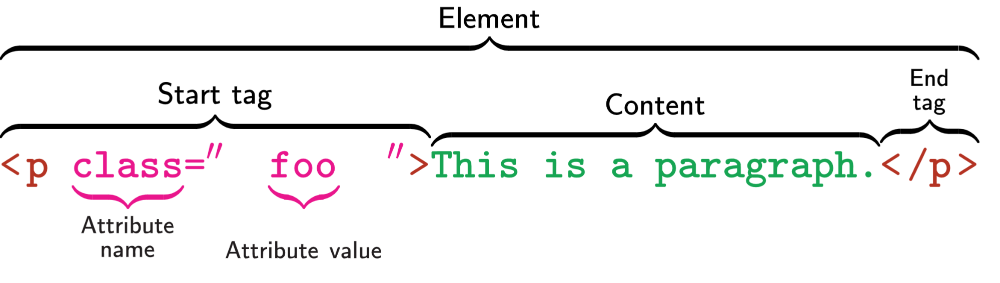

# Lesson 1: Introduction To HTML

<p>
In this lesson, we will learn about the first of the three languages called HTML. It helps to metaphorically think of HTML as the structure of a webpage. it is only concerned with describing what things are present on the webpage. What these things look like and how they behave is described by the two other languages that we will learn later. 
</p>



### Lesson Terminology:
- elements 
- tags
    - opening
    - closing
    - self-closing
- attributes:
    - name
    - value
- comments

#### Elements
<p>
An HTML page is just a collection of elements arranged in special ways. An element is made up of smaller parts. These smaller parts are: tags, attributes and content.
Below are some rules for elements:
</p>

### Lesson Terminology:
- elements may or may not have a closing tag, but they always have a opening tag.
- elements may or may not have attributes.
- elements may or may not have content. 

### Lesson Objectives:
At the end of this lesson you will be able to answer the following questions:
- What is HTML?
- What is HTML used for?
- What does an HTML document look like?
- What are the parts of an HTML document and what does each part describe?
- What is an HTML element?
- What parts can an HTML element have and what does each part do?
- What are the most commonly used HTML elements? (name then and also specify if they have a closing tag)

### HTML ELEMENTS:

#### Basic HTML Document Structure:
```html 
<!DOCTYPE html>
<html>
    <head>
        <title>Page Title</title>
    </head>
    <body>

        <h1>This is a Heading</h1>
        <p>This is a paragraph.</p>

    </body>
</html>
```

#### Signle and Multiline Comments:
```html 
<!-- This is a commnent and will not be rendered on the webpage -->
```

#### Text Formatting:
```html 
<p>I and am a P tag</p>
<h1>I and am an H1 tag</h1>
<h2>I and am an H2 tag/h2>
<h3>I and am an H3 tag</h3>
...
<h6>I and am an H46 tag</h6>
```


#### Anchor Tag:
Achor tags help us to go from one HTML page to another.
```html 
<a href="https://www.baidu.com/">Go to Baidu</a>
<a href="aboutus.html">Go to Youku</a>
```


